## XC App Onboarding Automation using Python based Terraform Orchestrator

This project provides a powerful, Python-based command-line tool to automate the deployment and lifecycle management of F5 Distributed Cloud (XC) HTTP Load Balancers using Terraform. It leverages an Excel spreadsheet as a user-friendly single source of truth, allowing for streamlined, repeatable, and scalable deployments.

## Features

* **Excel-Driven Configuration**: Manage hundreds of load balancer deployments from a single, easy-to-use Excel file.
* **Interactive CLI Menu**: A user-friendly menu to apply, destroy, view, and check the status of deployments.
* **Isolated State Management**: Uses Terraform CLI workspaces to create a separate, isolated state file for each load balancer, preventing conflicts and enabling parallel management.
* **Bulk Deployment**: Apply all pending configurations from the Excel sheet in a single command.
* **Configuration Preview**: A "dry run" option to view the configuration for a load balancer before deploying.
* **Status Checking & Drift Detection**: Run `terraform plan` on any active deployment to check for configuration drift.
* **On-Demand Configuration Refresh**: Update the `.tfvars` file for any deployment with the latest data from Excel without an immediate apply.
* **Deployment Export**: Create a timestamped zip archive of all `.tfvars` and `.tfstate` files for easy backup and migration.

---

## Project Structure

Your project folder must be organized as follows for the script to function correctly:

```bash
your-project-folder/
├── orchestrator.py
├── config.xlsx
├── main.tf
├── variables.tf
├── providers.tf
├── modules/
│   ├── http_load_balancer/
│   ├── origin_pool/
│   └── healthcheck/
├── tfvars/
│   └── (script creates .tfvars files here)
└── creds/
    └── your-key.p12
```

---

## Setup Instructions

### 1. Prerequisites

* **Terraform**: Ensure you have Terraform installed and accessible in your system's PATH.
* **Python**: Python 3.6+ is required. It's recommended to use a virtual environment.

### 2. Install Python Dependencies

Install the required libraries by running the following command in your terminal:

```bash
pip install pandas openpyxl json
```

## 3. F5 XC Credentials

-   Create a `creds/` directory in your project folder.
-   Place your F5 XC API credential file (e.g., `your-key.p12`) inside this `creds/` folder.

### 4. Terraform Modules

-   Place your root Terraform files (`main.tf`, `variables.tf`, `providers.tf`) in the main project directory.
-   Place your `http_load_balancer`, `origin_pool`, and `healthcheck` modules inside the `modules/` directory. The script relies on these modules to exist.

### 5. Excel Configuration

-   Prepare your `config.xlsx` file with two sheets: `Provider` and `LoadBalancers`. The structure is detailed in the "Excel File Format" section below.

---

## Excel File Format

The `config.xlsx` workbook must contain two sheets.

### `Provider` Sheet

This sheet contains global configuration and should have only **one row of data**.

| tenant_name | api_url | api_p12_file |
| :--- | :--- | :--- |
| abc-corp | `https://abc-corp.console...` | `./creds/your-key.p12` |


### `LoadBalancers` Sheet

This sheet is the main source of truth, containing the configuration for every load balancer, with one LB per row. Any column corresponding to an optional attribute in the Terraform code can be left blank to use the module's default value.

**Example Columns:**

| lb_name | namespace | domains | lb_labels | lb_type | lb_port | add_hsts | http_redirect | custom_cert_names | custom_cert_namespace | ip_threat_categories | create_origin_pool | existing_origin_pool_name | origin_pool_name | origin_server_type | origin_port | origin_labels | network_type | site_name | dns_name_private | k8s_service_name | ip_address_private | ip_address_public | dns_name_public | enable_healthcheck | healthcheck_name | healthcheck_type | healthcheck_http_path | enable_bot_defense | advertise_on_public_default_vip | advertise_custom | custom_site_name | site_network | enable_app_firewall | app_firewall_name | enable_csrf | csrf_policy_mode | csrf_custom_domains |
| :--- | :--- | :--- | :--- | :--- | :--- | :--- | :--- | :--- | :--- | :--- | :--- | :--- | :--- | :--- | :--- | :--- | :--- | :--- | :--- | :--- | :--- | :--- | :--- | :--- | :--- | :--- | :--- | :--- | :--- | :--- | :--- | :--- | :--- | :--- | :--- | :--- | :--- |
| web-lb-01 | a-adios | web.app.com | `env=prod` | https_auto_cert | 443 | TRUE | TRUE | | | `SPAM_SOURCES` | TRUE | | web-pool-01 | private_name | 8080 | `app=web` | outside | site-east | internal.web.com | | | | | TRUE | web-hc | http | /healthz | FALSE | TRUE | FALSE | | | TRUE | waf-prod | TRUE | all_domains | |
| api-lb-01 | a-adios | api.app.com | `env=prod` | https | 443 | TRUE | TRUE | `api-cert` | shared | | FALSE | shared-api-pool | | | | | | | | | | | | | | | | TRUE | TRUE | FALSE | | | FALSE | | FALSE | | |

---

## How to Use

Navigate to your main project directory in your terminal and run the orchestrator script:

```bash
python orchestrator.py
```

---

## How It Works: The Backend Flow

The orchestrator script acts as an intelligent wrapper around Terraform, translating the high-level configuration in your Excel sheet into specific, isolated actions. The entire workflow is designed to be safe, repeatable, and scalable.

Here is a simplified data flow for a typical "Apply" action:


### Step-by-Step Breakdown (Single Deployment)

```mermaid
graph LR
    subgraph "👤 User's Machine"
        direction LR
        subgraph " "
            User[fa:fa-user User] -->|1. Runs script & selects LB| Script
        end
        subgraph " "
            Excel[fa:fa-file-excel config.xlsx] -->|2. Reads row| Script
        end
    end

    subgraph "⚙️ Python Orchestrator"
        direction TB
        Script -->|3. Generates file| Tfvars[fa:fa-file-code tfvars/web-lb-01.tfvars]
        Script -->|4. Executes| TF_Commands
    end
    
    subgraph "🚀 Terraform Engine"
        direction TB
        TF_Commands[fa:fa-terminal terraform workspace new/select <br> terraform apply -var-file=...] -->|5. Reads config| TF_Core
        Tfvars --> TF_Core
        TF_Core -->|6. Makes API calls via Provider| F5_API
        TF_Core -->|8. Writes state| StateFile[fa:fa-save terraform.tfstate]
    end

    subgraph "☁️ F5 Distributed Cloud"
        direction TB
        F5_API[fa:fa-server F5 XC API] -->|7. Creates/Updates| LB[(fa:fa-network-wired Load Balancer)]
    end

    classDef default fill:#e3f2fd,stroke:#0d47a1,stroke-width:2px,color:black;
    classDef cloud fill:#ffe0b2,stroke:#e65100,stroke-width:2px,color:black;
    classDef user fill:#c8e6c9,stroke:#1b5e20,stroke-width:2px,color:black;
    class User,Excel user;
    class F5_API,LB cloud;
```



1.  **Initialization**: When you start the script, it runs `terraform init` once to ensure the backend and providers are ready. It then loads the `config.xlsx` file into memory.

2.  **User Selection**: You choose an action (e.g., "Apply") and select a specific load balancer from the menu.

3.  **Dynamic `.tfvars` Generation**: This is the core of the script's logic.
    -   The script takes the single row you selected from the Excel data.
    -   It creates a new, dedicated variables file in the `tfvars/` directory (e.g., `tfvars/web-lb-01.tfvars`).
    -   It populates this file with two types of variables:
        -   **Top-Level Variables**: Settings like `namespace`, `origin_pool_name`, and `healthcheck_type` are written as global variables.
        -   **`load_balancers` Object**: The `load_balancers` list variable is created with **only one object** inside it—the one corresponding to the load balancer you selected.

4.  **Terraform Workspace Management**:
    -   The script runs `terraform workspace list` to check if a workspace for your selected load balancer already exists.
    -   If it **doesn't exist**, it runs `terraform workspace new <lb_name>` to create it.
    -   If it **already exists**, it runs `terraform workspace select <lb_name>` to switch to it. This ensures that the state for each load balancer is completely isolated.

5.  **Targeted Terraform Execution**:
    -   The script constructs and runs the final Terraform command (e.g., `terraform apply`).
    -   Crucially, it uses the `-var-file` flag to point to the specific `.tfvars` file it just generated (e.g., `-var-file=tfvars/web-lb-01.tfvars`). This tells Terraform to ignore all other `.tfvars` files and only use the configuration for the deployment you are currently working on.

6.  **State Isolation**:
    -   Terraform executes the plan against the F5 XC API.
    -   Upon completion, Terraform automatically saves the result to the state file for the currently active workspace (e.g., `.terraform/terraform.tfstate.d/web-lb-01/terraform.tfstate`). This keeps the state of each load balancer completely separate.

7.  **Loop and Refresh**: After the action is complete, the script waits for you to return to the main menu. On each loop, it re-reads the `config.xlsx` file, ensuring that any changes you make in Excel are immediately available for the next action you take.

### Bulk Deployment Flow


The "Apply All Pending Deployments" option follows a similar logic but automates it for multiple deployments:

1.  **Identify Pending Deployments**: The script first gets the list of all load balancers from your Excel sheet and the list of all existing Terraform workspaces. It then identifies which load balancers are "pending" by finding the ones in Excel that do **not** have a corresponding workspace.

2.  **Confirmation**: It presents you with a list of all pending deployments it found and asks for a final `y/n` confirmation before proceeding.

3.  **Iterative Deployment**: If you confirm, the script begins a loop through **only the pending load balancers**. For each one, it performs the exact same sequence as a single deployment:
    -   Generate the specific `.tfvars` file.
    -   Create the new Terraform workspace (`terraform workspace new <lb_name>`).
    -   Run `terraform apply` using the correct `-var-file` flag.

This ensures that each new deployment is still created in its own isolated workspace, even when done in bulk.

